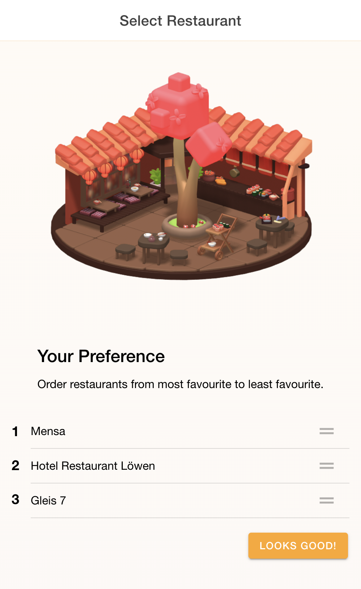

# Ionic React Capacitor Frontend PWA App

|                                               |                                                |
| --------------------------------------------- | ---------------------------------------------- |
|  |   |

This is an Ionic React Capacitor-based Progressive Web App (PWA) for building cross-platform web and mobile applications.

## Getting Started

Before you begin, make sure you have Node.js and npm installed. You will also need the Ionic CLI. If not, you can install it globally:

```
npm install -g @ionic/cli
```


## Installation

1. Clone this repository:

```
git clone git@github.com:mostafa-elhaiany/DineDevine.git
cd DineDevine
cd DineDevineUI
```

2. Install project dependencies:

````
npm install
````

3. Build the app for your target device (web, iOS, Android):

````
ionic build
````

4. Add platform-specific code to your project, depending on your target device:

### For iOS:

```
ionic cap add ios
ionic cap open ios
```
This command will open Xcode. You can run the app in the iOS simulator and perform testing.


### For Android:
```
ionic cap add android
ionic cap open android
```
This command will open Android Studio. You can run the app in the Android emulator and perform testing.

### For web development:
```
ionic serve
```
This will start a local development server and open the app in your web browser. You can make changes and see them immediately.


